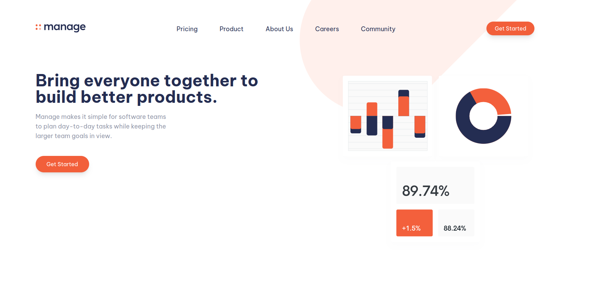

# Frontend Mentor - Manage landing page solution

This is a solution to the [Manage landing page challenge on Frontend Mentor](https://www.frontendmentor.io/challenges/manage-landing-page-SLXqC6P5).

- [Overview](#overview)
  - [The challenge](#the-challenge)
  - [Screenshot](#screenshot)
  - [Links](#links)
- [My process](#my-process)
  - [Built with](#built-with)
  - [What I learned](#what-i-learned)
  - [Continued development](#continued-development)
  - [Useful resources](#useful-resources)
- [Author](#author)
- [Acknowledgments](#acknowledgments)

# Overview

### The challenge

Users should be able to:

- ✅ View the optimal layout for the site depending on their device's screen size
- ✅ See hover states for all interactive elements on the page
- See all testimonials in a horizontal slider
  - ✅ sequentially displaying a subset of one or more slides
  - ✅ know number of slides present as well as a current slide
  - ❌ navigate to a next and previous slides
- ✅ Receive an error message when the newsletter sign up `form` is submitted if:
  - ✅ The `input` field is empty
  - ✅ The email address is not formatted correctly

### Screenshot

|          Desktop           |          Mobile           |
| :------------------------: | :-----------------------: |
|  |  |

### Links

- Solution URL: [Manage Landing Page](https://www.frontendmentor.io/solutions/responsive-landing-page-using-tailwindcss-and-typescript-tEhgBjQB5v)
- Live Site URL: [Manage Landing Page](https://theomaro.github.io/manage-landing-page)
- Clone this project
  ```sh
  $ git clone https://github.com/theomaro/manage-landing-page.git
  ```
## My process

### Built with

- Semantic HTML5 markup
- [TypeScript](https://www.typescriptlang.org/) language
- Flexbox & Grid
- Mobile first RWD
- [Tailwindcss](https://tailwindcss.com/) - CSS framework

### Continued development

Some of the areas that I wish to continue focusing on in future projects are:-

- Animations
- Transitions and Transformation
  
### Useful resources

- [Tailwindcss Official Documentation](https://tailwindcss.com/docs/installation) - The Documentation is amazing, helps me a lot with example code and explanations.
- [Tailwind Crash Course | Project From Scratch]([https://www.youtube.com/watch?v=00gyCtIQp8E](https://www.youtube.com/watch?v=dFgzHOX84xQ)) - This is an amazing project based tutorial which helped me finally understand tailwindcss framework to build a website. I'd recommend it to anyone still learning this concept.
- [How To Create An Image Slider In HTML, CSS & Javascript](https://www.youtube.com/watch?v=KcdBOoK3Pfw) - This is an amazing video which helped me finally understand how to create image slider to show different content. I'd recommend it to anyone still learning this concept.

## Author

- Website - [Mathew Maro Joseph](https://github.com/theomaro/theo)
- Frontend Mentor - [@theomaro](https://www.frontendmentor.io/profile/theomaro)
- Twitter - [@theo_pombe](https://www.twitter.com/theo_pombe)

## Acknowledgments

Special thanks to [TraversyMedia](https://www.youtube.com/@TraversyMedia) and [A gorgeous friends on the internet](https://www.youtube.com/@developedbyed) 👋
